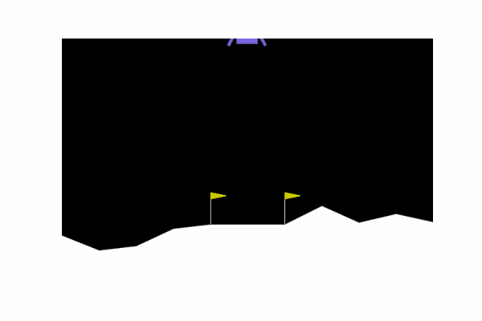

# PPO LunarLander — Reinforcement Learning with PyTorch

A complete implementation of **Proximal Policy Optimization (PPO)** to land a rocket on the moon using the **LunarLander-v2** environment from OpenAI Gym. This project includes full training, debugging, and enhancement of a faulty PPO pipeline — corrected, improved, and evaluated with advanced techniques like **GAE**, **advantage normalization**, and **value loss clipping**.

---

## What This Project Does

- ✅ Implements PPO using PyTorch
- ✅ Fixes multiple bugs in a broken baseline code
- ✅ Adds advanced PPO refinements:
  - Generalized Advantage Estimation (GAE)
  - Advantage Normalization
  - Value Function Clipping
  - Learning Rate Annealing
  - Gradient Clipping
- ✅ Logs metrics with Weights & Biases + TensorBoard
- ✅ Evaluates trained agents and visualizes results
- ✅ Achieves **>200 reward** in LunarLander-v2 🚀

---

## 📸 Demo



> _A trained PPO agent successfully landing the rocket in LunarLander-v2._

---

## 🔍 PPO Algorithm Summary

PPO is a powerful policy gradient algorithm that combines:

- An **actor-critic architecture**
- A clipped surrogate objective to **prevent large policy updates**
- Support for **generalized advantage estimation (GAE)** for better bias-variance tradeoff
- Robust to hyperparameter tuning and fast convergence

---

## ⚙️ Setup and Run

```bash
# Clone this repo
git clone https://github.com/gbr-rl/ppo-lunarlander.git
cd ppo-lunarlander

# Create a virtual environment
python -m venv venv
source venv/bin/activate     # or venv\Scripts\activate on Windows

# Install dependencies
pip install -r requirements.txt

# Launch Jupyter to explore and run training
jupyter notebook notebooks/ppo.ipynb
```

> You can also monitor training via TensorBoard:
```bash
tensorboard --logdir logs/
```

---

## 🧪 Evaluation

The notebook includes evaluation utilities to compute:
- Average episode returns
- Episode lengths
- Policy behavior using greedy/stochastic rollout

Results are logged and saved automatically for comparison.

---

## 📖 References

- Schulman et al., [Proximal Policy Optimization Algorithms (2017)](https://arxiv.org/abs/1707.06347)
- OpenAI Gym LunarLander-v2: https://www.gymlibrary.dev/environments/box2d/lunar_lander/
- PyTorch, Weights & Biases, TensorBoard

---

## 📩 Contact
I’m excited to connect and collaborate!  
- **Email**: [gbrohiith@gmail.com](mailto:your.email@example.com)  
- **LinkedIn**: [https://www.linkedin.com/in/rohiithgb/](https://linkedin.com/in/yourprofile)  
- **GitHub**: [https://github.com/GBR-RL/](https://github.com/yourusername)

---

## 📚 License
This project is open-source and available under the [MIT License](LICENSE).  

---

🌟 **If you like this project, please give it a star!** 🌟
